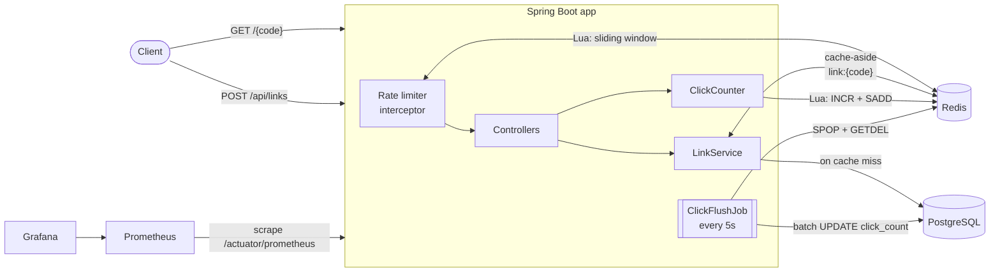
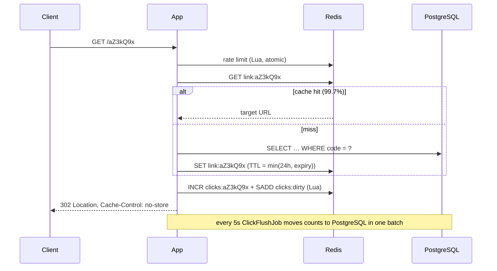

# URL Shortener

[](https://github.com/ebrahimmorkas/url-shortener/actions/workflows/ci.yml)


A read-heavy **URL shortening service** built with Java 21 and Spring Boot 3, designed the way you would in a
system-design interview and then actually built and measured. **Redis keeps PostgreSQL off the hot path**:
redirects are served from cache, clicks are counted with write-behind buffering, and abuse is throttled by a
distributed rate limiter.

## Measured performance

k6, 50 virtual users for 30s against the full Docker stack (app capped at 768 MB), all on a single 4-CPU laptop:

| Metric | Result |
|---|---|
| Throughput | **~606 redirects/s** (19,245 requests) |
| Errors | **0%** |
| Latency (client side) | median **58 ms**, p95 165 ms |
| Latency (server side, Prometheus) | p50 **49 ms** |
| Cache hit ratio | **99.74%** (19,180 hits / 50 misses) |
| Click accuracy | **19,230 redirects → 19,230 clicks** in PostgreSQL after write-behind flush |

Reproduce it with `docker compose up -d --build`, then run the k6 command in [Load testing](#load-testing).

## Architecture



### Redirect path



## Design decisions

### Short codes: collision-free and not guessable
The obvious approaches have problems. Random codes need a uniqueness check and retries. Base62 of an
auto-increment id is sequential, so anyone can enumerate every link. Here the id comes from a PostgreSQL sequence
and is **multiplied by a constant coprime with 62⁷, modulo 62⁷**, then Base62-encoded to 7 characters. That's a
bijection, so there are **zero collisions, no retries and no lookups**, while neighbouring ids produce unrelated
codes. Capacity is 62⁷ ≈ **3.5 trillion** links. A test pushes 200,000 consecutive ids through and verifies that
all 200,000 codes are unique.

Custom aliases can't collide with generated codes either: 7-character alphanumeric aliases are reserved for the
generator, so the two can never overlap.

### Cache-aside with negative caching
- Redirects read Redis first. On a miss they load from PostgreSQL and cache with **TTL = min(24h, time until
  expiry)**, so expired links are never served from cache.
- **Unknown codes are cached as "missing" for 60s**, so bots scanning random codes can't hammer the database.
- A new link **evicts its code after the transaction commits**. That closes the race where a probe re-caches
  "missing" between eviction and commit.
- `resolve()` is **not transactional**, so a cache hit never borrows a DB connection.
- **Fail-open:** Redis has a 200 ms timeout, and any error is treated as a miss. Redis is an optimisation, not a
  dependency.

### Write-behind click counting
Writing to the database on every click would make the most popular links the slowest. Instead:
1. Each redirect runs one **Lua script**: `INCR clicks:{code}` + `SADD clicks:dirty {code}` (atomic, one round trip).
2. Every 5s, `SPOP` hands each dirty code to **exactly one** instance. `GETDEL` takes the count atomically, so
   clicks that arrive mid-flush start a fresh counter. The counts go to PostgreSQL in **one JDBC batch**, and are
   put back into Redis if that write fails.
3. Redis runs with `volatile-lru`. Under memory pressure it evicts only TTL keys (cache entries, rate-limit
   windows) and never evicts un-flushed counters.

A test fires 300 concurrent clicks while 20 flushes race them, and gets exactly 300.

### Distributed rate limiting
A **sliding-window log** in a Redis sorted set, implemented as a Lua script:
- atomic check-and-record, and every app instance shares the same limits;
- uses **Redis `TIME`**, so clock skew between instances doesn't matter;
- declarative: `@RateLimited("create-link")` on a handler, with policies in YAML;
- standard `X-RateLimit-Limit` / `X-RateLimit-Remaining` / `Retry-After` headers and a 429 problem detail;
- **fails open** if Redis is unavailable.

A test sends 50 concurrent requests against a limit of 10, and exactly 10 get through.

### 302, not 301
301 responses get cached by browsers, which would make clicks uncountable and expiry unenforceable. So
redirects use `302` + `Cache-Control: no-store`.

## API

| Method | Endpoint | Description |
|---|---|---|
| `POST` | `/api/links` | Shorten `{url, customAlias?, expiresAt?}`. Rate limited to 20/min per IP |
| `GET` | `/{code}` | Redirect (`302`), `404` unknown, `410` expired. Rate limited to 600/min per IP |
| `GET` | `/api/links/{code}` | Link details |
| `GET` | `/api/links/{code}/stats` | Total clicks (flushed + buffered) |
| `GET` | `/actuator/prometheus` | Metrics |

Swagger UI: http://localhost:8080/swagger-ui.html

```bash
curl -X POST localhost:8080/api/links -H 'Content-Type: application/json' \
  -d '{"url":"https://spring.io/projects/spring-boot","customAlias":"spring-boot","expiresAt":"2030-01-01T00:00:00Z"}'
curl -i localhost:8080/spring-boot          # 302 Location: https://spring.io/...
curl localhost:8080/api/links/spring-boot/stats
```

## Getting started

```bash
docker compose up -d --build
```

| URL | What |
|---|---|
| http://localhost:8080 | The service |
| http://localhost:3000 | Grafana (dashboard **URL Shortener**, anonymous viewer access) |
| http://localhost:9090 | Prometheus |

### Load testing

```bash
docker run --rm -i --network url-shortener_default -e BASE_URL=http://app:8080 \
  grafana/k6 run - < load-test/redirects.js
```

Watch the Grafana dashboard while it runs: redirect rate, cache hit ratio, and p50/p95/p99 latency.

### Tests

```bash
./mvnw verify    # 43 tests; integration tests use Testcontainers PostgreSQL and Redis
```

## Tech stack

Java 21 · Spring Boot 3.5 · Spring Data JPA · Spring Data Redis (Lettuce, Lua scripts) · PostgreSQL 16 · Flyway ·
Redis 7 · Micrometer + Prometheus · Grafana · k6 · Testcontainers · JUnit 5 · Mockito · Docker · GitHub Actions

## Trade-offs and next steps

- **Cache stampede on cold keys.** The load test shows 50 misses for 15 links: concurrent first requests all
  miss. Request coalescing (single-flight) or a short lock would remove that.
- **Click counts are eventually consistent** (≤ 5s behind in the database). The stats endpoint adds the buffered
  counts back, so the API is always current.
- **Client identity is the remote IP.** Behind a proxy, enable `server.forward-headers-strategy`, and only trust
  `X-Forwarded-For` from that proxy.
- Next: per-day click histograms, API keys with per-key quotas, read replicas for cache misses.

## License

[MIT](LICENSE)
